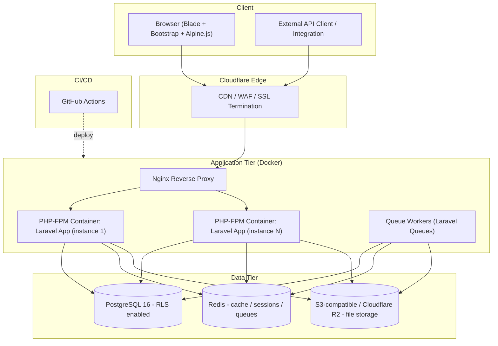
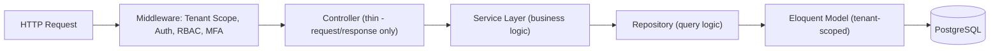
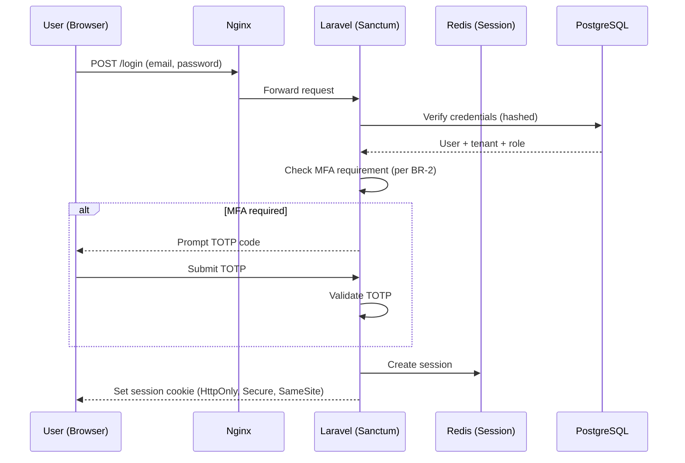
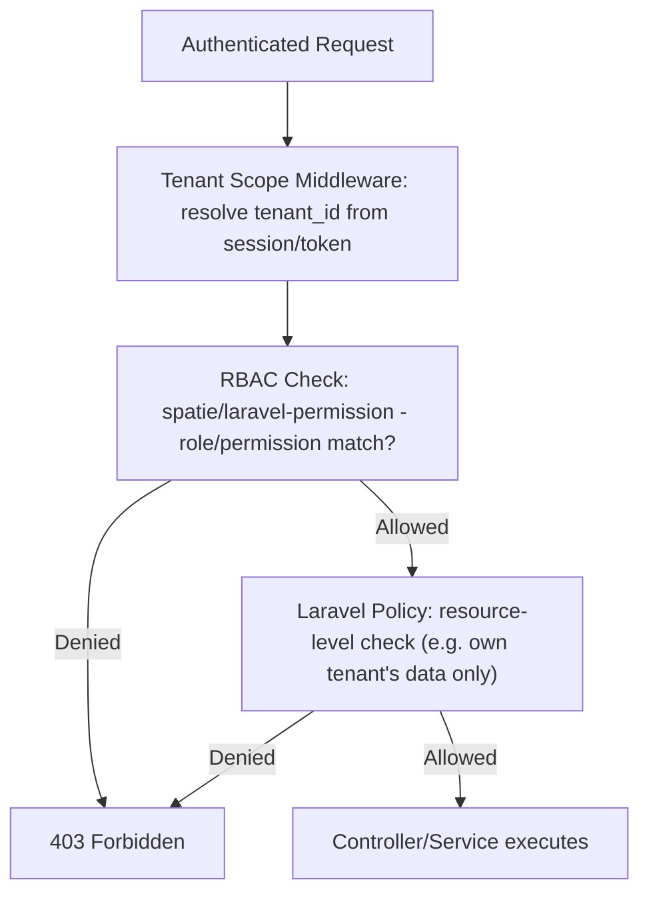
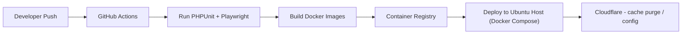

# CybCademy — Phase 4: System Architecture Document

**Product:** CybCademy — Human Cyber Risk Management & Cybersecurity Awareness Platform
**Developed by:** Solunar Informatics
**Document Version:** 1.0
**Date:** 28 July 2026
**Status:** Draft for Approval
**Depends on:** Phase 1–3 (approved)

---

## 1. Architecture Diagram



**Summary:** Cloudflare terminates SSL and provides CDN/WAF at the edge. Nginx reverse-proxies to horizontally-scalable PHP-FPM containers running the Laravel application. Redis backs sessions, cache, and queues. PostgreSQL is the system of record with Row-Level Security enforcing tenant isolation. Queue workers handle async work (phishing sends, report generation, AI calls). File storage is offloaded to S3-compatible object storage so application containers remain stateless and horizontally scalable.

---

## 2. Monolith vs. Microservices Decision

**Decision: Modular Monolith.**

| Factor | Assessment |
|---|---|
| Team size | Single engineering team at launch — microservices' coordination overhead outweighs benefit |
| Traffic profile | Unproven at launch; no component has a demonstrated independent scaling need yet |
| Operational maturity | No dedicated platform/SRE function yet to run distributed tracing, service mesh, multi-pipeline deploys |
| Extraction path | Modules built with clear internal boundaries (see folder structure below) so any module (e.g. Phishing Simulation, AI Assistant) can be extracted into its own service later if its scaling profile diverges |

**Conclusion:** Ship as a modular monolith. Revisit only if a specific module demonstrates scaling or team-ownership needs that the monolith can't serve — not before.

---

## 3. Folder Structure

```
cybcademy/
├── app/
│   ├── Modules/
│   │   ├── Auth/
│   │   │   ├── Controllers/
│   │   │   ├── Services/
│   │   │   ├── Repositories/
│   │   │   ├── Models/
│   │   │   ├── Policies/
│   │   │   └── Requests/
│   │   ├── Organisation/
│   │   ├── Employee/
│   │   ├── LMS/                  # Course Builder, Player, Question Bank, Certificates
│   │   ├── Policy/                # Policy Management & Acknowledgement
│   │   ├── PhishingSimulation/
│   │   ├── IncidentReporting/
│   │   ├── Analytics/             # Human Risk Score, Compliance/Executive Dashboards
│   │   ├── AuditCentre/
│   │   ├── AI/                    # AI Tutor, Quiz Generator, Summariser, etc.
│   │   ├── Billing/
│   │   └── Notifications/
│   ├── Http/
│   │   ├── Middleware/            # TenantScope, RoleCheck, MFAEnforcement, RateLimiting
│   │   └── Kernel.php
│   ├── Support/                   # Shared traits (BelongsToTenant), helpers
│   └── Providers/
├── database/
│   ├── migrations/
│   ├── seeders/
│   └── factories/
├── routes/
│   ├── web.php                    # Session-authenticated dashboard routes
│   ├── api.php                    # JWT-authenticated /api/v1/* routes
│   └── console.php
├── resources/
│   ├── views/                     # Blade templates, organised per module
│   └── assets/                    # Bootstrap overrides, Alpine.js components
├── tests/
│   ├── Unit/
│   ├── Feature/
│   └── Security/                  # Tenant-isolation leak-detection tests, RBAC tests
├── docker/
│   ├── nginx/
│   └── php/
├── .github/workflows/             # CI/CD pipelines
└── docs/                          # Mermaid diagrams, phase documents
```

Each module is self-contained (own controllers/services/repositories/models/policies), following the pattern: **Controller → Service Layer → Repository → Eloquent Model**, keeping business logic out of controllers and out of models.

---

## 4. MVC / Layered Architecture



- **Controllers** validate input (via Form Requests) and delegate — no business logic.
- **Services** contain business rules (e.g. Human Risk Score calculation, certificate issuance logic).
- **Repositories** encapsulate query logic, making the tenant-scoping enforcement point auditable and testable in one place per module.
- **Models** apply a `BelongsToTenant` global scope automatically wherever a `tenant_id` column is present, so omitting a manual scope in a controller/service cannot leak data (defence in depth alongside PostgreSQL RLS).

---

## 5. REST API Architecture

- Versioned under `/api/v1/`.
- JWT bearer token authentication (separate from web session auth).
- Domains: Organisation, Employee, Course, Assessment, Certificate, Reporting, Incident (per Phase 2 FR-10.3) — full endpoint specification produced in Phase 8.
- Rate limiting applied per API token, tenant, and endpoint category.
- Consistent envelope for responses (`data`, `meta`, `errors`) and standard HTTP status code usage.
- OpenAPI specification to be generated in Phase 8 as the authoritative contract.

---

## 6. Authentication Flow



External API/integration auth follows a separate flow: client credentials or personal access token exchanged for a short-lived JWT, validated per-request without a server-side session.

---

## 7. Authorization Flow



Every request resolves tenant context first, then role/permission, then resource-level policy — three enforcement layers before any tenant data is touched, consistent with SRS BR-5 (no cross-tenant visibility under any code path).

---

## 8. Database Architecture

- PostgreSQL 16, single shared database, shared schema.
- Every tenant-scoped table carries a `tenant_id` column.
- **Row-Level Security (RLS) policies** enforce `tenant_id = current_setting('app.current_tenant')` at the database engine level — the last line of defence beneath application-layer scoping.
- Application sets `app.current_tenant` per request/connection via middleware before any query executes.
- Full schema design deferred to Phase 5.

---

## 9. Caching

- Redis used for: session storage, Laravel Queue backend, and application-level query caching (notably Executive/Compliance Dashboard aggregate queries, which are expensive and don't need real-time freshness to the second).
- Cache keys are tenant-namespaced (`tenant:{id}:...`) to prevent any possibility of cross-tenant cache bleed.
- Cache invalidation tied to relevant model events (e.g. course completion invalidates that tenant's dashboard cache).

## 10. File Storage

- S3-compatible object storage (Cloudflare R2 preferred, given Cloudflare is already in the stack).
- Bucket/key structure namespaced per tenant: `tenants/{tenant_id}/certificates/...`, `tenants/{tenant_id}/policies/...`.
- Signed, time-limited URLs for private file access (certificates, policy documents) — no public bucket access.

## 11. Deployment Architecture



- Docker Compose orchestrates: Nginx, PHP-FPM app containers, queue worker containers, Redis, (PostgreSQL managed separately — recommend a managed Postgres service or a dedicated, carefully-backed-up host rather than co-locating the primary data store in the same Compose stack as the app tier).
- Blue/green or rolling deployment for zero-downtime releases (exact strategy finalised in Phase 13).

## 12. Logging

- Application logs (errors, performance) separate from **audit logs** (security-relevant actions per SRS FR-8.1).
- Audit logs are append-only, written to a dedicated PostgreSQL table with restricted write access (application service account only, no direct human write access) — satisfying the "immutable" requirement.
- Structured JSON logging for application logs, shippable to a centralised log aggregator (tool selection deferred to Phase 13/DevOps).

## 13. Monitoring

- Application performance monitoring against the NFR targets defined in Phase 2/3 (p95 dashboard < 2s, API < 500ms).
- Queue depth and worker health monitored (phishing campaign sends and report generation are the most likely sources of backlog).
- Uptime monitoring against the 99.5% v1.0 target.
- Full tool selection (e.g. self-hosted vs managed APM) deferred to Phase 13 — flagged here as a requirement, not a product choice.

---

## Deliverables

- This Architecture Document (diagrams, folder structure, MVC/API/auth/authorization flows, DB/caching/storage/deployment/logging/monitoring architecture)

## Assumptions

- A managed or dedicated PostgreSQL host will be used in production rather than co-locating the database inside the same container orchestration as the stateless app tier.
- Cloudflare R2 is available/acceptable to the team; AWS S3 remains a drop-in alternative given Laravel's filesystem abstraction.
- Team has capacity to implement and test PostgreSQL RLS policies correctly — this is a security-critical, not cosmetic, component and should get dedicated review in Phase 12 (Security Testing).

## Risks

- RLS misconfiguration could create a false sense of security if policies aren't tested as rigorously as application-layer scoping — Phase 12 must include explicit tenant-isolation penetration testing, not just functional testing.
- Co-locating Redis-backed cache, session, and queue responsibilities on one Redis instance is operationally simple but creates a single point of contention under load — acceptable for v1.0, flagged as a scaling risk to revisit post-GA (separate Redis instances per concern).
- Deployment strategy (blue/green vs rolling) not yet finalised — deferred to Phase 13 but should not be left until the last responsible moment given zero-downtime is implied by the 99.5% uptime NFR.

## Next Phase

**Phase 5 — Database Design:** ER diagram, full schema (tables, indexes, relationships, constraints, normalisation), and migration strategy — building directly on the tenant_id + RLS model confirmed here.
