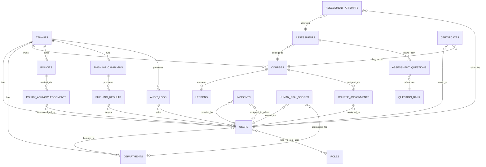

# CybCademy — Phase 5: Database Design Document

**Product:** CybCademy — Human Cyber Risk Management & Cybersecurity Awareness Platform
**Developed by:** Solunar Informatics
**Document Version:** 1.0
**Date:** 28 July 2026
**Status:** Draft for Approval
**Depends on:** Phase 1–4 (approved)
**Database Engine:** PostgreSQL 16

---

## 1. Design Principles

- Every tenant-scoped table includes `tenant_id UUID NOT NULL REFERENCES tenants(id)`, enforced by PostgreSQL Row-Level Security (per Phase 4).
- Every table includes `created_at`, `updated_at`, and `deleted_at` (soft delete) unless explicitly noted as append-only/immutable (e.g. audit logs, which are never updated or soft-deleted — they are retained per tenant data retention policy and archived, not deleted, in the normal application flow).
- Primary keys are UUIDs (`gen_random_uuid()`) — avoids sequential ID enumeration across tenants and simplifies future sharding/DB-per-tenant migration if ever required.
- Foreign keys enforced at the database level; no orphaned records permitted.
- Schema normalised to 3NF; deliberate denormalisation (e.g. cached `human_risk_score` on the employee record) is called out explicitly where used, for dashboard read performance.

---

## 2. Entity Relationship Diagram (Core Entities)



---

## 3. Core Tables

### 3.1 `tenants`
| Column | Type | Notes |
|---|---|---|
| id | UUID PK | |
| name | VARCHAR(255) | |
| industry | VARCHAR(100) | |
| subscription_tier | ENUM(basic, professional, enterprise) | |
| compliance_frameworks | JSONB | Configurable framework mapping (POPIA, NDPA, etc.) |
| created_at / updated_at / deleted_at | TIMESTAMPTZ | |

*(`tenants` itself is the tenant boundary — not tenant_id-scoped.)*

### 3.2 `users`
| Column | Type | Notes |
|---|---|---|
| id | UUID PK | |
| tenant_id | UUID FK → tenants | Indexed |
| department_id | UUID FK → departments, nullable | |
| email | VARCHAR(255) | Unique per tenant (composite unique with tenant_id) |
| password_hash | VARCHAR(255) | Argon2id/bcrypt |
| mfa_enabled | BOOLEAN | Enforced true for privileged roles (BR-2) |
| mfa_secret | VARCHAR(255), encrypted at rest | |
| status | ENUM(active, inactive, invited) | |
| cached_human_risk_score | NUMERIC(5,2), nullable | Denormalised for dashboard read performance; source of truth is `human_risk_scores` |
| created_at / updated_at / deleted_at | TIMESTAMPTZ | |

**Indexes:** `(tenant_id, email)` unique; `(tenant_id, department_id)`; `(tenant_id, status)`

### 3.3 `roles`, `permissions`, `role_user` (via spatie/laravel-permission conventions)
Standard pivot structure: `roles(id, tenant_id, name)`, `permissions(id, name)`, `role_has_permissions`, `model_has_roles(role_id, model_id, model_type, tenant_id)`. Roles are tenant-scoped (an "Organisation Administrator" role exists per tenant, not globally shared), permissions are global (the permission catalogue is fixed by the platform).

### 3.4 `departments`
| Column | Type | Notes |
|---|---|---|
| id | UUID PK | |
| tenant_id | UUID FK | |
| name | VARCHAR(255) | |
| parent_department_id | UUID FK → departments, nullable | Supports hierarchy |
| created_at / updated_at / deleted_at | | |

---

### 3.5 Learning Management

**`courses`**: id, tenant_id, title, description, status (draft/published/archived), created_by (FK users), created_at/updated_at/deleted_at.

**`lessons`**: id, tenant_id, course_id (FK), title, content_type (video/text/interactive), content_url, sequence_order, created_at/updated_at/deleted_at.

**`question_bank`**: id, tenant_id, question_text, question_type (mcq/true_false/scenario), options (JSONB), correct_answer (JSONB), created_at/updated_at/deleted_at.

**`assessments`**: id, tenant_id, course_id (FK), title, passing_score, created_at/updated_at/deleted_at.

**`assessment_questions`**: id, assessment_id (FK), question_id (FK → question_bank), sequence_order. *(Pivot table — no tenant_id needed directly, scoped transitively via assessment_id.)*

**`assessment_attempts`**: id, tenant_id, assessment_id (FK), user_id (FK), score, passed (BOOLEAN), submitted_at, created_at/updated_at.

**`course_assignments`**: id, tenant_id, course_id (FK), user_id (FK), assigned_by, due_date, completed_at (nullable), status (assigned/in_progress/completed/overdue), created_at/updated_at/deleted_at.

**`certificates`**: id, tenant_id, user_id (FK), course_id (FK), certificate_uid (unique, publicly verifiable), issued_at, file_path (S3/R2), created_at/updated_at.

**Indexes:** `(tenant_id, course_id)` across lessons/assessments; `(tenant_id, user_id, status)` on course_assignments for dashboard queries; unique `(certificate_uid)` globally for public verification lookups.

---

### 3.6 Policy Management

**`policies`**: id, tenant_id, title, version, file_path, published_at, created_at/updated_at/deleted_at.

**`policy_acknowledgements`**: id, tenant_id, policy_id (FK), user_id (FK), acknowledged_at, ip_address, created_at. *(Append-only / immutable per SRS BR-3 — no `updated_at` edits; corrections are new rows against a new policy version, never UPDATE.)*

**Indexes:** `(tenant_id, policy_id, user_id)` — used to determine outstanding acknowledgements quickly.

---

### 3.7 Phishing Simulation

**`phishing_campaigns`**: id, tenant_id, name, template_id (FK → phishing_templates), target_scope (JSONB: department/role/individual criteria), scheduled_at, status, created_by, created_at/updated_at/deleted_at.

**`phishing_templates`**: id, tenant_id (nullable — platform-provided templates have null tenant_id, tenant-authored/AI-generated ones are scoped), subject, body, ai_generated (BOOLEAN), created_at/updated_at/deleted_at.

**`phishing_results`**: id, tenant_id, campaign_id (FK), user_id (FK), event_type (sent/opened/clicked/submitted_credentials/reported), event_at, created_at.

**Indexes:** `(tenant_id, campaign_id, user_id)`; `(tenant_id, campaign_id, event_type)` for results aggregation.

**Access control note:** per SRS BR-4, individual-level `phishing_results` are restricted at the application/policy layer to Security Officer/Compliance/Admin roles; Manager role queries are pre-aggregated to department level only — enforced in the Analytics module's repository layer, not left to ad hoc query-time filtering.

---

### 3.8 Incident Reporting

**`incidents`**: id, tenant_id, reported_by (FK users), assigned_to (FK users, nullable), category (phishing/suspicious_activity/policy_violation/other), description, status (open/in_progress/resolved/closed), reported_at, resolved_at (nullable), created_at/updated_at/deleted_at.

**Indexes:** `(tenant_id, status)`; `(tenant_id, assigned_to)`.

---

### 3.9 Analytics

**`human_risk_scores`**: id, tenant_id, user_id (FK, nullable if department-level), department_id (FK, nullable if user-level), score (NUMERIC 5,2), calculated_at, contributing_factors (JSONB — training/assessment/phishing weighting breakdown), created_at.

*(Time-series table — new row per calculation cycle, not an UPDATE, to preserve historical trend for Executive Dashboard trending per PRD Section 4 KPI.)*

**Indexes:** `(tenant_id, user_id, calculated_at)`; `(tenant_id, department_id, calculated_at)`.

---

### 3.10 Audit Centre

**`audit_logs`**: id, tenant_id, actor_user_id (FK, nullable for system-generated events), action (VARCHAR — e.g. `policy.acknowledged`, `user.role_changed`, `data.exported`), resource_type, resource_id, before_state (JSONB, nullable), after_state (JSONB, nullable), ip_address, occurred_at, created_at.

**Immutability:** No `updated_at`/`deleted_at`. Table has restricted UPDATE/DELETE privileges — only the application's audit-writer service role has INSERT; even superuser DB access for admin purposes should go through a documented break-glass procedure, not routine access (flagged for Phase 7).

**Indexes:** `(tenant_id, occurred_at)`; `(tenant_id, resource_type, resource_id)`; `(tenant_id, action)`.

---

### 3.11 Platform / Billing

**`subscriptions`**: id, tenant_id, tier, seats_licensed, billing_cycle, status, current_period_start, current_period_end, created_at/updated_at.

**`api_tokens`**: id, tenant_id, user_id (FK, nullable for service accounts), token_hash, scopes (JSONB), last_used_at, expires_at, created_at/updated_at/deleted_at.

**`notifications`**: id, tenant_id, user_id (FK), type, payload (JSONB), read_at (nullable), created_at.

---

## 4. Normalisation

Schema is normalised to **3NF**. Deliberate, documented denormalisation:
- `users.cached_human_risk_score` — avoids a join/aggregate on every dashboard load; refreshed via model event when a new `human_risk_scores` row is written for that user.
- `phishing_campaigns.target_scope` and `human_risk_scores.contributing_factors` use JSONB rather than fully normalised child tables — both are write-once-read-many, schema-flexible payloads where full normalisation would add join overhead without a corresponding query benefit.

## 5. Constraints Summary

- Composite unique constraint: `(tenant_id, email)` on `users` — same email may exist across different tenants (e.g. a consultant working with two client organisations).
- All FK columns indexed.
- CHECK constraints on ENUM-like status fields where PostgreSQL native ENUM types are not used, to prevent invalid state values at the database layer, not just application validation.
- NOT NULL enforced on `tenant_id` for every tenant-scoped table — this is the column PostgreSQL RLS policies key off, so it cannot be nullable.

## 6. Row-Level Security Policy Pattern

```sql
ALTER TABLE users ENABLE ROW LEVEL SECURITY;

CREATE POLICY tenant_isolation_users ON users
    USING (tenant_id = current_setting('app.current_tenant')::uuid);
```

Applied uniformly to every tenant-scoped table via a migration helper/trait, so no table can be added to the schema without RLS being applied by default — new tables require an explicit, reviewed exception to *opt out* of RLS, not an explicit step to opt in.

## 7. Migration Strategy

- Laravel migrations, one migration per table/logical change, version-controlled in `database/migrations/`.
- RLS policy creation included in the same migration as the table creation (not a separate later step), so RLS coverage cannot silently lag behind schema changes.
- Seeders provide: platform-level phishing templates, default permission catalogue, and demo tenant data for development/staging only (never run against production).
- Migration rollback (`down()`) implemented for every migration; CI pipeline (Phase 13) runs a migrate-then-rollback-then-migrate check to catch irreversible migrations before merge.

---

## Deliverables

- This Database Design Document (ER diagram, schema, indexes, constraints, normalisation notes, RLS pattern, migration strategy)

## Assumptions

- UUID primary keys are acceptable from a performance standpoint at expected scale (indexing overhead vs. sequential integers is a well-understood, acceptable trade-off for the isolation/security benefit).
- `human_risk_scores` as a time-series table (append-only) is acceptable in terms of storage growth; a data-retention/archival policy for old score rows should be defined before this becomes a large-table performance concern (flagged as a risk below).

## Risks

- `human_risk_scores` and `audit_logs` are both append-only, ever-growing tables — without a partitioning or archival strategy, these will become the largest and slowest-to-query tables in the system over time. Recommend table partitioning by `tenant_id` and/or date range be planned before GA, not retrofitted after a customer complains about slow dashboards.
- JSONB fields (`target_scope`, `contributing_factors`, `compliance_frameworks`) trade query-ability for flexibility — if the Compliance Dashboard later needs to filter/report deeply on JSONB contents, GIN indexes will be needed; not included in this initial design and should be added if/when that reporting need is confirmed in Phase 6/UI design.
- RLS policy coverage is only as good as migration discipline — the "opt-out not opt-in" pattern (Section 6) mitigates this but should still be verified by an automated test that fails CI if any tenant-scoped table lacks an RLS policy (tie-in to Phase 12 security testing).

## Next Phase

**Phase 6 — UI/UX:** Design system (typography, spacing, colour palette, icons), navigation, dashboard layouts, wireframes refined to high fidelity, mobile and desktop design, accessibility — built on the Blade + Bootstrap 5 + Alpine.js frontend stack confirmed in Phase 4.
