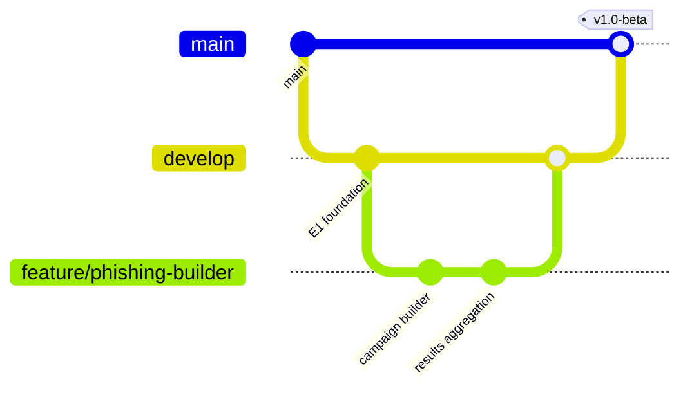

# CybCademy — Phase 9: Development Plan

**Product:** CybCademy — Human Cyber Risk Management & Cybersecurity Awareness Platform
**Developed by:** Solunar Informatics
**Document Version:** 1.0
**Date:** 28 July 2026
**Status:** Draft for Approval
**Depends on:** Phase 1–8 (approved)

---

## 1. Epics

Epics map directly to the modules established in Phases 1–8, sequenced to respect dependencies (foundation before features that rely on it).

| Epic | Description | Depends On |
|---|---|---|
| E1 — Platform Foundation | Multi-tenancy, RLS, Auth, MFA, RBAC, Tenant/Org/Employee management | None (foundation) |
| E2 — Learning Management | Course Builder, Course Player, Question Bank, Assessments, Certificates | E1 |
| E3 — Policy Management | Policy upload/versioning, acknowledgement tracking | E1 |
| E4 — Phishing Simulation | Campaign builder, templates, sending, results tracking | E1, E9 (AI, for template generation) |
| E5 — Incident Reporting | Report submission, triage workflow | E1 |
| E6 — Analytics & Dashboards | Human Risk Score engine, Compliance/Executive dashboards | E1–E5 (consumes data from all) |
| E7 — Audit Centre | Immutable logging, evidence export | E1 (logging hooks needed across all epics as they're built) |
| E8 — API & Integrations | Public REST API, OpenAPI spec implementation | E1–E7 (exposes what exists) |
| E9 — AI Features | Tutor, Quiz Generator, Policy Summariser, Phishing Generator, Risk Recommendations, Executive Reports, Chat Assistant | E2, E3, E4, E6 (each AI feature attaches to its host module) |
| E10 — Billing & Platform | Subscription tiers, seat billing, notifications, knowledge base | E1 |
| E11 — Hardening & Release | Security testing, performance testing, documentation, deployment | All prior epics |

---

## 2. Features & Representative Tasks (Sample — E1 and E4)

**E1 — Platform Foundation**
- F1.1 Tenant provisioning (task: schema migration + RLS policy scaffold; task: tenant onboarding wizard)
- F1.2 Authentication (task: login/MFA flow; task: password policy engine; task: SSO/OAuth2 integration)
- F1.3 RBAC (task: role/permission seed data; task: policy classes per module; task: middleware pipeline)
- F1.4 Employee management (task: CRUD; task: CSV import + async job; task: lifecycle event hooks)

**E4 — Phishing Simulation**
- F4.1 Campaign builder UI (task: targeting logic; task: scheduling)
- F4.2 Template management (task: platform template library; task: AI-generated template integration)
- F4.3 Sending pipeline (task: queue-based send worker; task: tracking pixel/click endpoint; task: rate-limit safeguards per Phase 7 Section 10)
- F4.4 Results & reporting (task: aggregation logic enforcing BR-4; task: just-in-time educational redirect)

*(Full task breakdown for all epics maintained in the project's issue tracker, not duplicated here — this document establishes the epic/feature structure that tracker will follow.)*

---

## 3. Sprint Plan (Indicative — 2-week sprints)

| Sprint | Focus |
|---|---|
| 1–2 | E1: Foundation — tenancy, auth, MFA, RBAC scaffolding |
| 3 | E1: Employee/Org management complete; CI/CD pipeline operational |
| 4–5 | E2: Learning Management (Course Builder, Player) |
| 6 | E2: Assessments, Question Bank, Certificates |
| 7 | E3: Policy Management |
| 8–9 | E4: Phishing Simulation |
| 10 | E5: Incident Reporting |
| 11–12 | E6: Analytics & Dashboards (Human Risk Score engine, Compliance/Executive dashboards) |
| 13 | E7: Audit Centre |
| 14 | E8: API & Integrations |
| 15–16 | E9: AI Features (integrated incrementally into host modules, feature-flagged per subscription tier) |
| 17 | E10: Billing & Platform |
| 18–20 | E11: Hardening — security testing (incl. independent ASVS assessment), performance testing, documentation, release prep |

This aligns to the milestone structure defined in Phase 3 (M1–M7, GA), with M1 (design sign-off) corresponding to completion of Phases 4–8, already underway.

---

## 4. Git Strategy

- **Trunk-based development** with short-lived feature branches (`feature/E4-phishing-campaign-builder`), merged via pull request with required review and passing CI (PHPUnit + Playwright + static analysis).
- Branch naming convention: `feature/{epic}-{short-description}`, `fix/{ticket-id}-{short-description}`, `hotfix/{short-description}`.
- No direct commits to `main` — enforced via GitHub branch protection rules.
- Commit messages follow Conventional Commits format for automated changelog generation.

## 5. Branching Strategy

- `main`: always deployable, protected, tagged at each release.
- `develop`: integration branch for the current sprint's work, deployed continuously to staging.
- Feature branches off `develop`, merged back via PR.
- Release branches (`release/1.0`) cut from `develop` for hardening/stabilisation immediately before a milestone release (E11), allowing `develop` to continue accepting the next milestone's work in parallel where feasible.

## 6. Release Strategy

- Continuous deployment to **staging** on every merge to `develop`.
- **Closed Beta** deployment (per Phase 3 release plan) from a stabilised `release/1.0` branch, with pilot customers.
- **Production (GA)** release only after: all Phase 12 test suites pass, independent ASVS Level 2 assessment findings are remediated, and Phase 15 go-live checklist is signed off.
- Semantic versioning (`MAJOR.MINOR.PATCH`) from v1.0.0 onward; pre-GA builds tagged `v1.0.0-beta.N`.
- Rollback strategy (blue/green, per Phase 4/13) means any production release can be reverted to the previous tagged version without a database rollback in the common case; migrations are written to be backward-compatible for at least one release cycle where feasible (expand/contract pattern) to keep rollback safe.

---

## Deliverables

- This Development Roadmap (epics, features, sample tasks, indicative sprint plan, Git/branching/release strategy)

## Assumptions

- Team capacity supports roughly 20 two-week sprints (~9-10 months) from foundation to GA at the indicative pace shown — actual velocity to be confirmed once Sprint 1-2 establishes a real baseline, and this plan should be revisited after that baseline exists rather than treated as fixed.
- AI features (E9) can be integrated incrementally into their host modules rather than requiring a separate standalone AI platform build-out first — each AI feature is scoped as an enhancement to an existing epic's module, not a parallel epic with its own foundation.
- A staging environment mirroring production configuration (including RLS, MFA enforcement) is available from Sprint 1 onward, so security-relevant behaviour is tested continuously rather than only at the end.

## Risks

- The AI features epic (E9) spans six of the ten other epics as dependencies — if any host module epic slips, its corresponding AI feature slips with it; recommend tracking AI feature completion as a sub-line of its host epic's status, not as an independent epic that could mislead on overall readiness.
- Indicative sprint plan places Hardening (E11) as a single block at the end (Sprints 18–20) — this is the classic "security testing as a phase-gate at the end" anti-pattern that risks discovering material findings too late to remediate calmly. Recommend lightweight security review checkpoints after each epic (not deferred entirely to E11) even though the full ASVS assessment remains an end-of-cycle activity.
- Trunk-based development with short-lived branches requires CI to be fast and reliable from Sprint 1 — if CI/CD setup (part of F1) slips, it risks becoming a bottleneck exactly when the team needs it most (E4 onward, as feature velocity increases).

## Next Phase

**Phase 10 — Backend Development:** Production-ready PHP/Laravel code, module by module, following PSR standards, full PHPDoc, and the architecture/security/database decisions established in Phases 4, 5, and 7.
